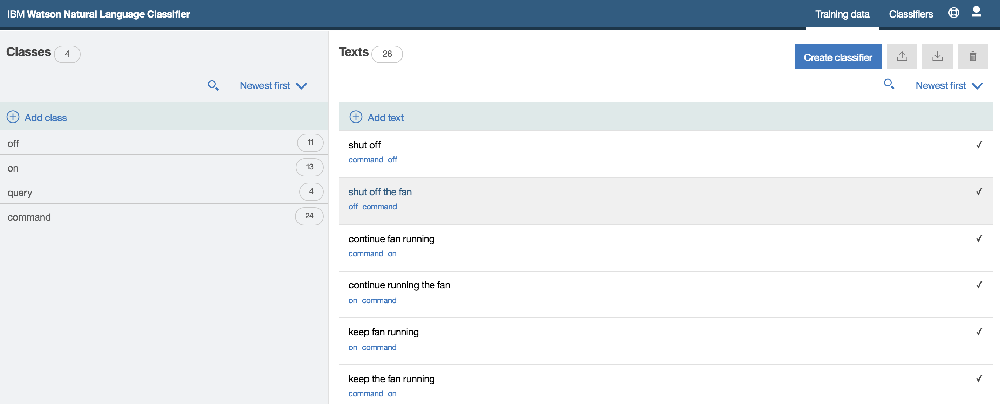

# openwhisk-nlc-action
An OpenWhisk docker action that uses Watson Natural Language Classifier to classify input text.

# Overview
In the next few sections, we will see how to build serverless cognitive solution to apply natural language processing to an input text using Watson Natural Language Classifier and open technologies such as IBM OpenWhisk & Docker.

## Use case
Let's say we want to develop a natural language interface to to interact with an IoT device. To make things simple, lets assume that we are dealing with a **Fan** as an IoT device.

# Components Involved
- [Watson Natural Language Classifier](https://www.ibm.com/watson/developercloud/nl-classifier.html)
- [OpenWhisk](https://new-console.ng.bluemix.net/openwhisk/)
- [Docker Container](https://www.docker.com/)

# Setup Watson Natural Language Classifier
Watson NLC enables developers to create natural language interface for their application. The service interprets the intent behind text and returns a corresponding classification with associated confidence levels. You can find the details of Watson NLC [here](https://www.ibm.com/watson/developercloud/nl-classifier.html).

For this demo, we will use [Watson NLC toolkit](https://www.ibm.com/watson/developercloud/doc/nl-classifier/tool_overview.shtml) to manage classifier. It is simple to get started with NLC toolkit as it provides a visual interface to define classes, add training data, create classifier, test the classifier.

The natural language interface take an input text, process it through Watson NLC and enable user to interact with the device in following ways:
 - query if device is operational
 - turn on the device
 - turn off the device

You can see the sample classes and training data created using NLC toolkit in the screenshot below:

Here, we have created few classes and added some training data to create a classifier. Normally, you will go through multiple iteration depending on the size of the training data to ensure that classification works as expected for new texts.

# Create OpenWhisk Action
[https://developer.ibm.com/openwhisk/](OpenWhisk) provides a distributed compute service to execute application logic in response to events. It is similar to other serverless computing platforms such as [AWS Lambda](https://aws.amazon.com/lambda/), [Azure Functions](https://azure.microsoft.com/en-us/services/functions/), [Google Cloud Functions](https://cloud.google.com/functions/), [webtask](https://webtask.io/) etc..

We will create a [docker action](https://console.ng.bluemix.net/docs/openwhisk/openwhisk_actions.html#openwhisk_actions_docker) for this example. The logic is written is python ([classifier.py](docker-action)).

 
